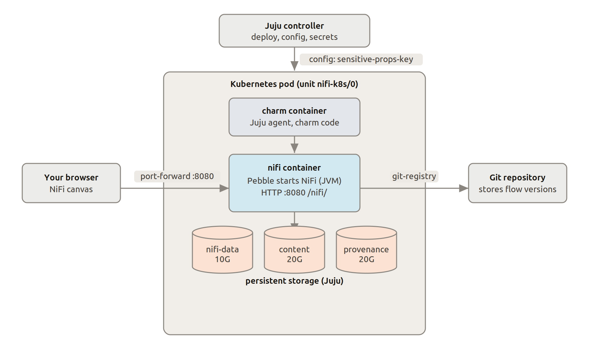
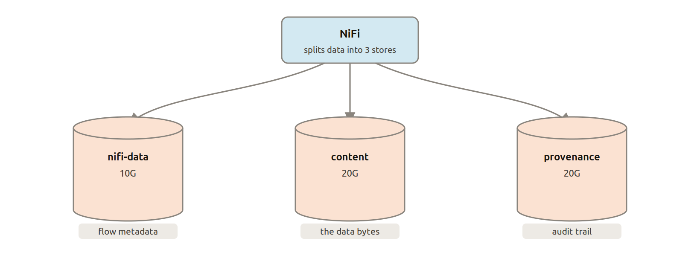

.. _explanation-architecture-overview:

Architecture overview
=====================

This page explains how Charmed Apache Nifi is structured — from the Kubernetes pod up
to the data stores — and how the key pieces fit together.

Charmed Apache Nifi deployment
------------------------------

A single Juju unit (``nifi-k8s/0``) runs as a Kubernetes pod with two
containers:

* **Charm container** — runs the Juju agent and charm code. It receives
  configuration and secrets (such as the ``sensitive-props-key``) from the
  Juju controller and applies them to Apache Nifi.
* **Apache Nifi container** — runs the Apache Nifi JVM process (managed by Pebble) and
  exposes the web UI and API on port ``8080`` at ``/nifi/``.

The browser reaches the Apache Nifi canvas via a port-forward to port 8080. When the
optional ``git-integrator`` charm is integrated, the Apache Nifi container connects to
a Git repository to store and retrieve versioned flow definitions.

Persistent storage
------------------

Apache Nifi writes data to three separate Juju-managed persistent volumes:

.. list-table::
   :header-rows: 1
   :widths: 20 15 65

   * - Volume
     - Size
     - Contents
   * - ``nifi-data``
     - 10 GB
     - Flow metadata — the flow definition, processor configuration, and
       connection state.
   * - ``content``
     - 20 GB
     - FlowFile content — the actual data bytes being processed.
   * - ``provenance``
     - 20 GB
     - Provenance events — the audit trail of every action taken on every
       FlowFile.

Separating these stores lets Apache Nifi manage retention and performance for each
independently.

How data moves: FlowFiles and Connections
-----------------------------------------

.. image:: ../images/flowfile-anatomy.png
   :alt: Anatomy of a FlowFile — attributes and content
   :align: center

Every piece of data that moves through a flow is a **FlowFile**. It has:

* **Attributes** — lightweight key/value labels (filename, MIME type, size,
  custom fields). Processors can read and modify these without touching the
  content.
* **Content** — the actual bytes of the payload, stored in the content
  repository. Content can range from zero bytes to many gigabytes.

.. image:: ../images/flow-concept.png
   :alt: A Processor connected to another Processor via a Connection queue
   :align: center

**Processors** transform or route FlowFiles. Each processor exposes one or more
named **relationships** (``success``, ``failure``, ``retry``, …). A
**Connection** links a relationship on one processor to the input of another,
acting as a back-pressure-aware queue between them.

This model means:

* Slow downstream processors buffer work in the connection queue rather than
  dropping data.
* Failed FlowFiles can be routed to a separate error path without interrupting
  the main flow.
