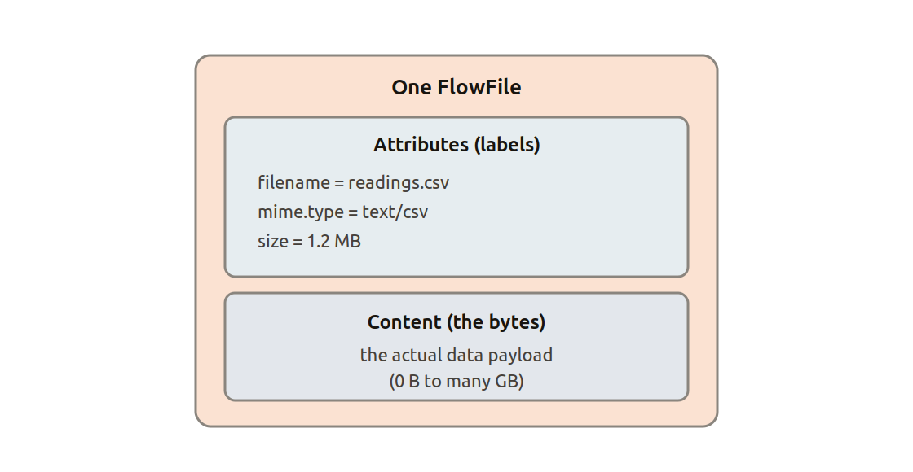
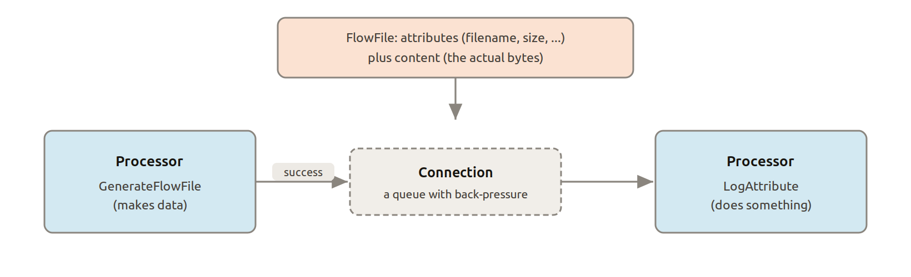

.. _explanation-nifi-core-concepts:

Apache Nifi core concepts
=========================

`Apache NiFi`_ is a data logistics platform. You build *flows* on a visual
canvas by connecting boxes together - no code required. Each box does one
thing (read a file, call an API, transform a record) and data moves between
them automatically.

The following concepts appear throughout the Apache Nifi UI and documentation.

FlowFile
--------

A FlowFile is the unit of data in Apache Nifi. It has two parts:

* **Attributes:** key/value metadata (filename, MIME type, timestamps, custom fields)
* **Content:** the payload (a file, a JSON document, a database row, etc.)

Every piece of data that moves through a flow is a FlowFile.

Processor
---------

A Processor is a single step in a flow. Apache Nifi ships with hundreds of built-in
processors for common tasks: reading from files or queues, calling HTTP
endpoints, transforming records, writing to databases, and more.

Each processor has:

* **Properties:** configuration specific to that processor
* **Relationships:** named outputs (*success*, *failure*, *retry*, etc.) that
  route FlowFiles to the next step

Connection
----------

A Connection links one processor's relationship to the next processor. It acts
as a queue, holding FlowFiles until the downstream processor is ready to
consume them.

Process Group
-------------

A Process Group is a folder that contains processors and connections. Groups
can be nested, allowing you to organise a large flow into logical sub-flows and
re-use common patterns.

Controller Service
------------------

A Controller Service is a shared resource — a database connection pool, an
SSL context, a schema registry — that multiple processors in the same Process
Group can reference. It is configured once and reused everywhere.

Flow Registry Client
--------------------

A Flow Registry Client connects Apache Nifi to an external version-control system
(GitHub or GitLab). Once configured, you can save flow definitions to a git
repository and restore or promote them across environments.

Charmed NiFi sets up a Flow Registry Client automatically when you integrate
with the `Git Integrator`_ charm.
