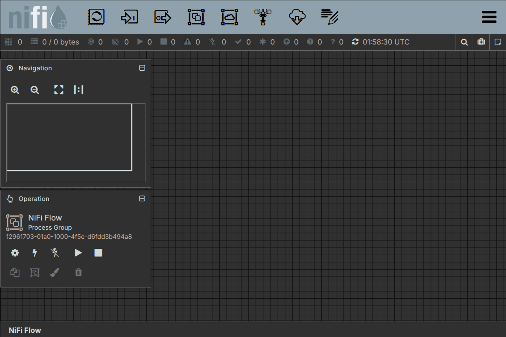

.. _tutorial-first-flow:

Build your first flow
=====================

This tutorial walks you through building a minimal flow in the Apache Nifi canvas:
a **GenerateFlowFile** processor that creates synthetic data and a
**LogAttribute** processor that logs its metadata. By the end you will have
seen data move through Apache Nifi and know the basic canvas interactions.

.. note::

   This tutorial assumes Apache Nifi is already deployed and the UI is accessible.
   If you haven't done that yet, follow the
   :doc:`deploy guide <deploy-using-terraform>` first.

What you'll do
--------------

#. Open the Apache Nifi canvas.
#. Add and configure a **GenerateFlowFile** processor.
#. Add a **LogAttribute** processor.
#. Connect the two processors.
#. Start the flow and verify data is moving.
#. Stop the flow and clean up.

Open the Apache Nifi canvas
--------------------

Open the Apache Nifi web UI in your browser. You can reach it via the unit IP
(``http://<unit-ip>:8080/nifi/``) or through an ingress URL if you have one
configured. See the :doc:`deploy guide <deploy-using-terraform>` for details
on accessing the UI.

You should see the empty canvas.

Add the GenerateFlowFile processor
------------------------------------

**GenerateFlowFile** creates synthetic FlowFiles on a schedule. It is the
simplest way to produce data without an external source.

#. Drag the **Processor** icon (the ``[P]`` box in the top toolbar) onto the
   canvas. The *Add Processor* dialog opens.

   .. image:: ../images/nifi-add-processor.png
      :alt: Add Processor dialog with search field
      :align: center

#. Type ``GenerateFlowFile`` in the search field, select it from the list,
   and click **Add**.

#. Double-click the new processor to open its configuration.

#. On the **Scheduling** tab set **Run Schedule** to ``5 sec`` (so it fires
   every five seconds rather than as fast as possible).

#. Click **Apply**.

Add the LogAttribute processor
---------------------------------

**LogAttribute** writes every FlowFile's attributes to the Apache Nifi application
log. It is the simplest way to verify that data is arriving.

#. Drag a second **Processor** onto the canvas.
#. Search for ``LogAttribute``, select it, and click **Add**.
#. Leave the default configuration and click **Apply**.

Connect the processors
----------------------

#. Hover over **GenerateFlowFile** until a grey circle (the *connection
   handle*) appears on its edge.
#. Drag from that handle to **LogAttribute**. The *Create Connection* dialog
   opens.
#. Ensure the **success** relationship is checked and click **Add**.

   .. image:: ../images/nifi-connection.png
      :alt: Canvas showing GenerateFlowFile connected to LogAttribute
      :align: center

Start the flow
--------------

#. Right-click an empty area of the canvas and choose **Select All**.
#. Right-click again and choose **Start**. Both processors turn green.

   .. image:: ../images/nifi-flow-running.png
      :alt: Both processors running (green status indicators)
      :align: center

Wait about ten seconds, then verify data is flowing:

* The **In** and **Out** counters on **GenerateFlowFile** increment.
* The **In** counter on **LogAttribute** increments.

To see the log output, run:

.. code-block:: bash

   kubectl exec -n <model> nifi-k8s-0 -c nifi -- \
     grep LogAttribute /var/log/nifi/nifi-app.log | tail -20

Replace ``<model>`` with your Juju model name (e.g. ``nifi``).

Stop the flow and clean up
--------------------------

#. Right-click an empty area of the canvas and choose **Select All**.
#. Right-click again and choose **Stop**.
#. Right-click the connection between the two processors and choose
   **Empty Queue** to drain any queued FlowFiles.
#. Right-click **GenerateFlowFile** and choose **Delete**.
#. Right-click **LogAttribute** and choose **Delete**.

The canvas is now empty and Apache Nifi is idle.

Next steps
----------

* :doc:`/explanation/nifi-core-concepts` - understand the concepts behind
  what you just built.
* Read the `Apache Apache Nifi documentation`_ for the full processor catalogue.
